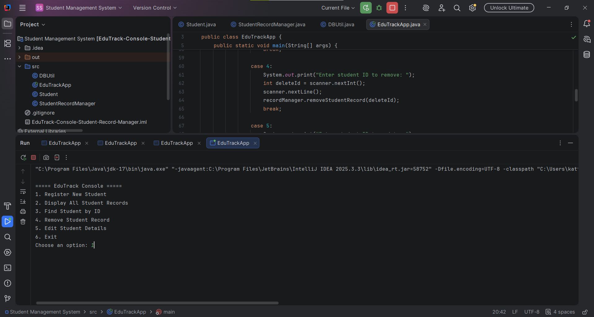
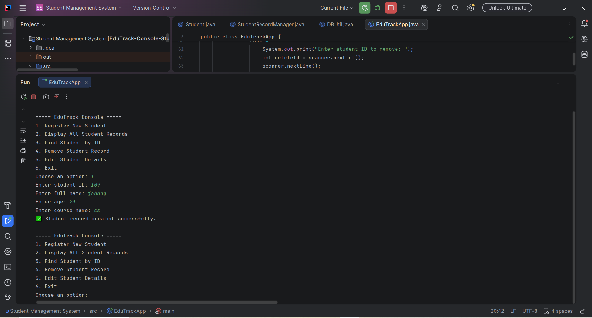
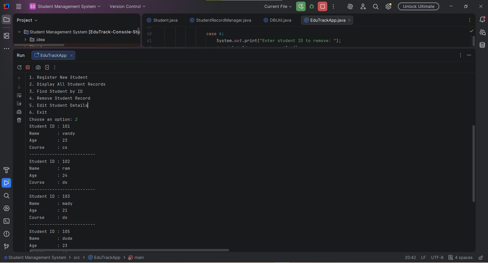
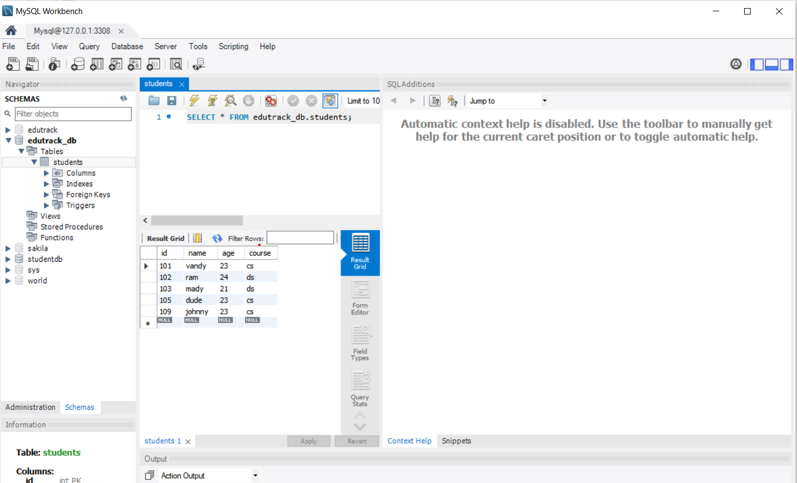

# EduTrack Console - Student Record Manager

EduTrack is a console-based Java application designed to manage student records efficiently using JDBC and MySQL.  
It demonstrates real-world CRUD operations with database integration.

---

## 🚀 Features
- Register new student
- View all student records
- Search student by ID
- Update student details
- Delete student record

---

## 🛠️ Technologies Used
- Java
- JDBC (Java Database Connectivity)
- MySQL Database

---

## 📂 Project Structure
src/
├── Student.java
├── StudentRecordManager.java
├── DBUtil.java
└── EduTrackApp.java

---

## 📸 Screenshots

### Main Menu


### Add Student


### View Students


### Database (MySQL)


---

## ▶️ How to Run

1. Install MySQL Server  
2. Create a database:
   ```sql
   CREATE DATABASE edutrack_db;
3.Open the project in IntelliJ IDEA

4.Update your MySQL password in DBUtil.java

5.Run EduTrackApp.java
